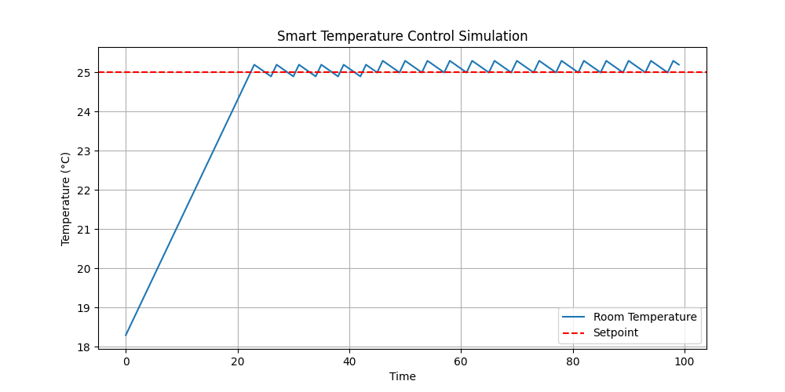

#
A Python-based closed-loop temperature control simulation that models automated room temperature regulation using ON/OFF feedback control logic.

## Features
- Heater ON/OFF control
- Temperature setpoint tracking
- Dynamic room temperature simulation
- Real-time graphical visualization

## Technologies Used
- Python
- NumPy
- Matplotlib

## Engineering Concepts
- Closed-loop control systems
- Thermostat logic
- Feedback control
- System response simulation

## Simulation Output

